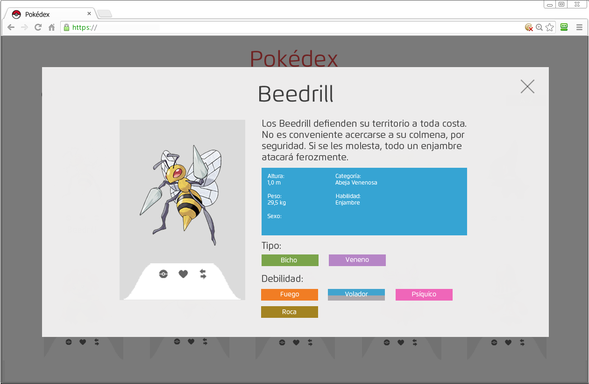

# Pokedex

### Objetivo:
- Crear un pokedex con los conocimientos de Ajax y usando la API de pokemon.

### Màs informaciòn del ejercicio

- Usar JSON formatter o Postman para obtener la informaciòn de PokeApi.
- PokeApi no da imagenes de los pokemon, solo stats, estas tendràs que conseguirlas tù.
- Usar cualquier framework CSS de preferencia.
- Mostrar el detalle del pokemon en un modal o en una tab dinàmica. No recargar la pàgina para el detalle.

### Producto final requerido
-Grilla de Pokemones

-Modal Pokemon

### Pàgina realizada

En este link se muestra el producto final: 
